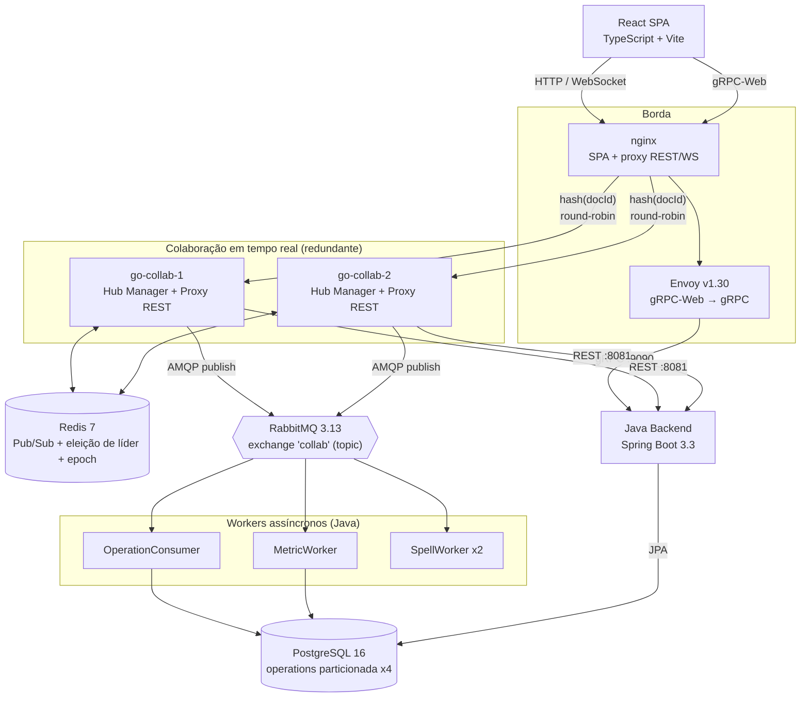
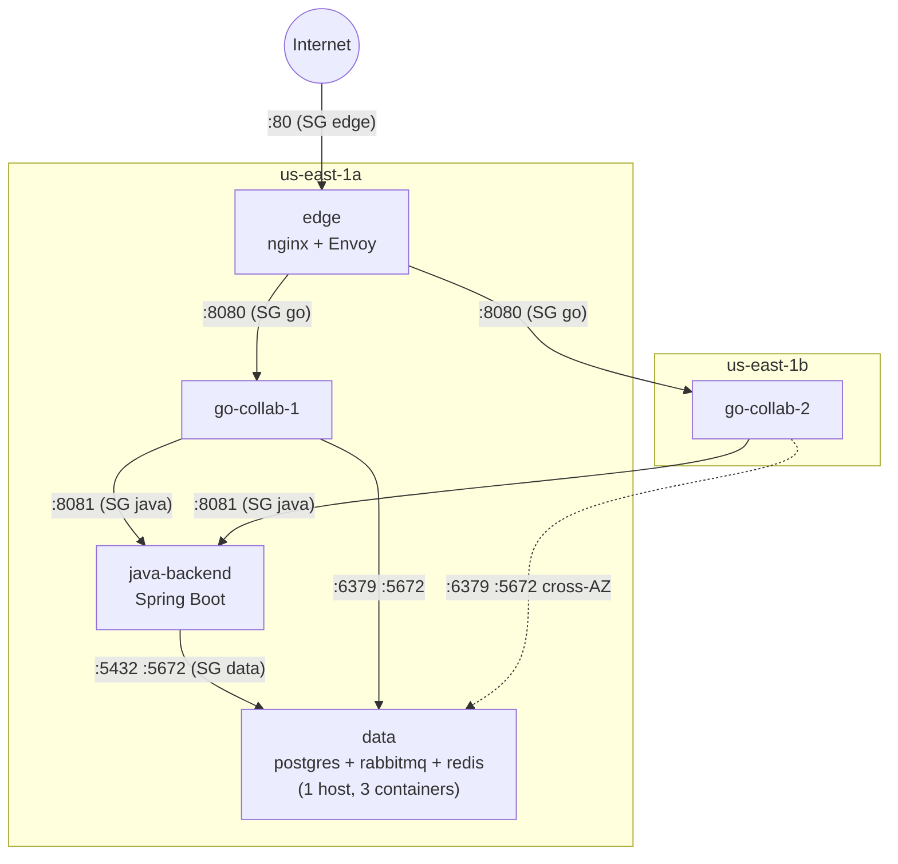
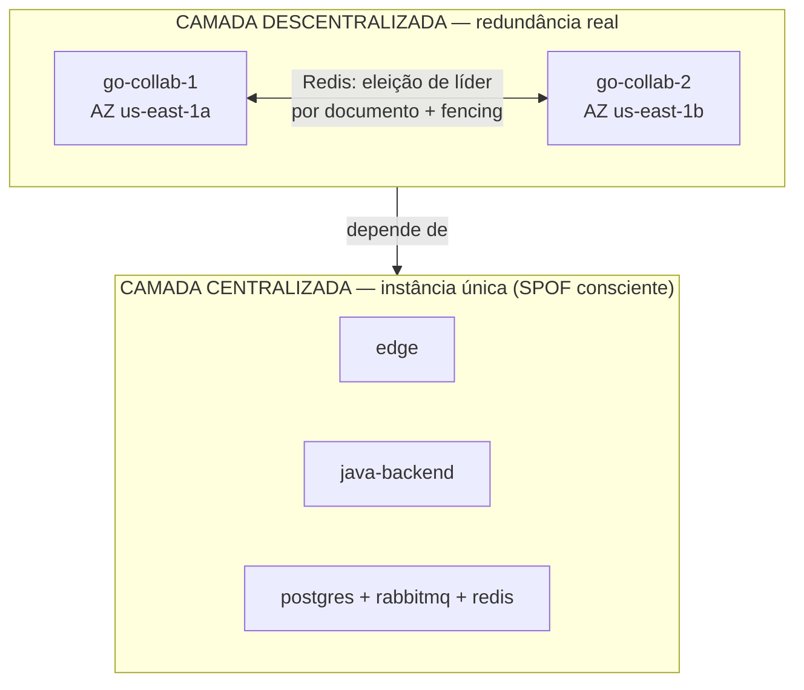
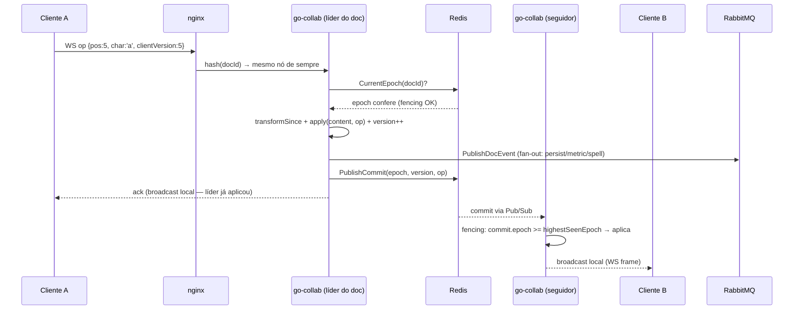
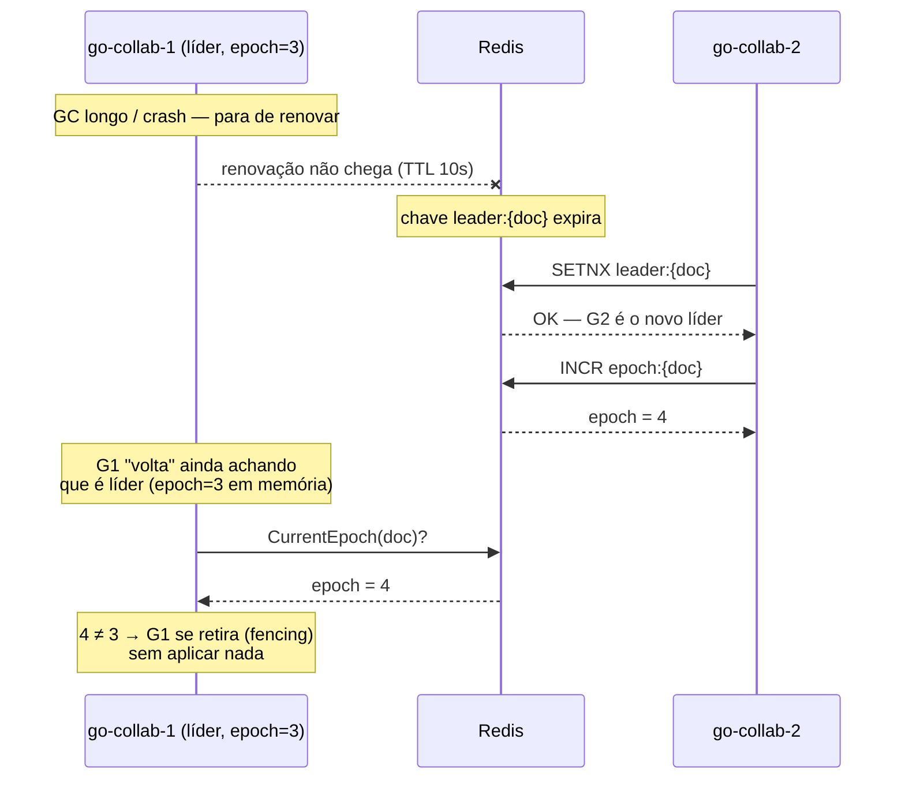
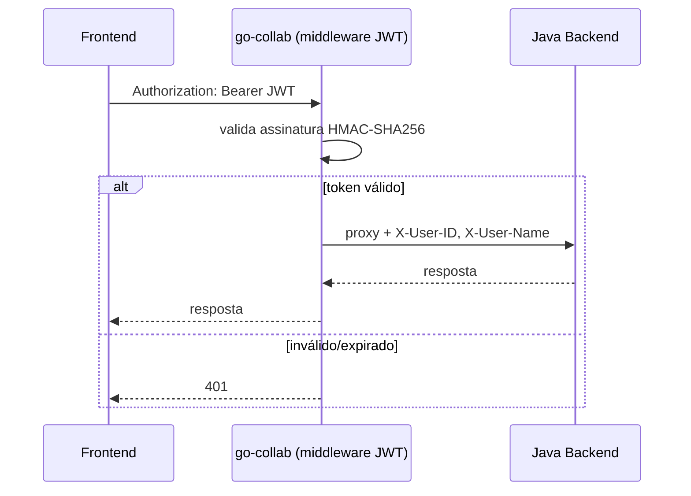

# Arquitetura do Sistema — CollabDocs

## Visão geral

CollabDocs é um editor de documentos colaborativo em tempo real construído
como sistema distribuído concorrente. Este documento tem três objetivos:
mostrar **a arquitetura** (containers, implantação física, protocolos),
mostrar **as decisões arquiteturais** que produziram esse desenho — com o
que foi considerado e recusado, não só o resultado final — e mostrar
honestamente **o que é descentralizado/redundante hoje e o que ainda é um
ponto único**. O "como" de cada mecanismo (código, testes, configuração)
fica nos documentos de apoio linkados ao longo do texto
(`docs/go-concurrency.md`, `docs/rabbitmq-events.md`, `docs/terraform/`).

---

## Stack tecnológica por camada

| Camada | Tecnologia | Papel |
|---|---|---|
| **Cliente** | React 18 + TypeScript + Vite 5 | SPA do editor, WebSocket client, OT no lado do cliente |
| **Borda / roteamento** | nginx (alpine) | Serve o SPA, proxy REST + WebSocket com afinidade por documento |
| **Borda / gRPC-Web** | Envoy v1.30 | Traduz gRPC-Web (browser) → gRPC nativo (Java) |
| **Colaboração em tempo real** | Go 1.22 · Gin · gorilla/websocket · golang-jwt v5 | Hub por documento (Actor), OT no servidor, proxy REST autenticado |
| **Coordenação entre nós Go** | Redis 7 (`redis/go-redis v9`) | Pub/Sub + eleição de líder (`SETNX`+TTL) + fencing por epoch |
| **Mensageria assíncrona** | RabbitMQ 3.13 (management) · `amqp091-go` · Spring AMQP | Exchange topic `collab`, fan-out para 3 filas de processamento |
| **Backend de domínio** | Java 21 · Spring Boot 3.3 (Web, Security, Data JPA, AMQP) · gRPC | Auth, CRUD de documentos, persistência de operações, métricas, spell-check, analytics via gRPC |
| **Persistência** | PostgreSQL 16 (alpine) | Usuários, documentos, permissões, operações (particionada por hash), métricas |
| **Infraestrutura (deploy real)** | Terraform ≥ 1.5 · AWS (EC2, ECR, VPC, Route53, Security Groups) | 5 instâncias EC2 em 2 AZs, provisionamento declarativo |
| **Empacotamento** | Docker (multi-stage builds) · Docker Compose (dev local) | Mesmas imagens rodam local (Compose) e na AWS (systemd + Docker) |

---

## Diagramas

### Diagrama de containers (arquitetura lógica)



### Diagrama de implantação (AWS — 5 EC2, 2 AZs)



Cada seta corresponde a uma regra explícita de um dos 4 security groups do
projeto — nenhuma camada alcança outra além da imediatamente "abaixo" dela
na cadeia (`docs/terraform/security_groups.tf.md`). Descoberta de serviço
usa uma zona privada Route53 (`collabdocs.internal`) em vez de IP fixo
(`docs/terraform/route53.tf.md`).

### Arquitetura descentralizada vs. centralizada



A redundância real (2 processos independentes, em máquinas físicas
diferentes, coordenando estado compartilhado sem um deles ser um ponto
único de falha) existe hoje **só na camada de colaboração em tempo real**.
As demais camadas são uma única instância cada — decisão consciente de
escopo (ver ADR-06), não uma limitação escondida. A ironia mais visível do
design atual: a redundância do `go-collab` depende de um Redis que **não é
ele mesmo redundante** — se `data` cair, as duas réplicas de `go-collab`
continuam de pé, mas perdem a capacidade de eleger líder entre si.

### Fluxo de edição em tempo real



Passo a passo com o código real de cada etapa: `docs/go-concurrency.md`
(fencing) e `docs/rabbitmq-events.md` (publicação do evento).

### Failover de liderança



Este é o cenário do "líder zumbi" — o motivo pelo qual TTL sozinho não
basta e o fencing por epoch existe. Detalhado com o código real em
`docs/go-concurrency.md` §4.2.

### Autenticação



O Java **confia** nos headers `X-User-ID`/`X-User-Name` sem revalidar o
JWT — a rede interna, restrita por security group, é a fronteira de
confiança (ver ADR-07).

---

## Decisões arquiteturais

Formato ADR-lite: contexto, decisão tomada, alternativas consideradas e
recusadas, e os trade-offs reais (não só vantagens) de cada escolha.

### ADR-01 — Concorrência de estado por documento: Actor (goroutine + canais), não mutex

**Contexto.** N documentos podem estar sendo editados ao mesmo tempo; cada
edição precisa ler/escrever `content`/`version`/`ops` com segurança, sem
travar documentos que não têm relação entre si.

**Decisão.** Um goroutine dedicado por documento (`Hub.run()`), acesso ao
estado só via canais — nunca por método direto.

**Alternativas consideradas:**
- *Mutex global* (um lock só, para todos os documentos) — serializaria
  edições em documentos completamente diferentes sem necessidade, jogando
  fora o paralelismo real que existe entre eles.
- *Mutex por documento com métodos convencionais* — funcionalmente
  parecido, mas exige disciplina manual de `Lock()`/`Unlock()` em cada
  método novo, com risco real de deadlock ao compor chamadas e de
  esquecimento silencioso (o compilador não avisa).

**Trade-offs:**
- ✅ Estruturalmente impossível esquecer de sincronizar — só existe um
  caminho de acesso ao estado.
- ✅ Paralelismo real entre documentos diferentes — cada `Hub` roda em
  paralelo nos cores da CPU disponíveis.
- ⚠️ Toda leitura de estado "de fora" (ex.: endpoint de status) precisa de
  um round-trip por canal, mais verboso que ler um campo direto.
- ⚠️ Um `Hub` processando algo anormalmente lento bloquearia esse
  documento inteiro até a próxima iteração do `select` (não observado na
  prática — todo handler é rápido — mas é a hipótese que o design assume).

Detalhes e código real: `docs/go-concurrency.md` §1.

---

### ADR-02 — Eleição de líder por documento via Redis (SETNX+TTL) com fencing por epoch, não consenso forte

**Contexto.** As 2 réplicas do `go-collab` podem receber edições do mesmo
documento ao mesmo tempo; alguém precisa decidir, sem ambiguidade, a ordem
final das operações.

**Decisão.** Eleição leve via `SETNX`+TTL no Redis, **líder por
documento** (não um líder único para o sistema inteiro), reforçada por um
*fencing token* monotônico (epoch) para descartar decisões de um líder já
superado.

**Alternativas consideradas:**
- *Consenso forte* (Raft/Paxos via etcd ou Consul) — tolera failover sem
  o "líder zumbi" por construção, mas exige um cluster de 3+ nós próprio e
  paga uma latência maior por decisão (quorum de escrita) — desproporcional
  ao problema (ordenar operações de um editor de texto, não transações
  financeiras).
- *Primary fixo* (`go-collab-1` sempre líder, por convenção) — trivial de
  implementar, mas sem failover automático: a queda do primary paralisaria
  a edição até intervenção manual, e seria um SPOF explícito no componente
  que o trabalho existe para tornar redundante.
- *Sem líder, last-write-wins direto no banco* — perderia a ordenação
  total que a OT exige para transformar operações corretamente.

**Trade-offs:**
- ✅ Líder **por documento**, não por sistema — `go-collab-1` pode liderar
  o documento A enquanto `go-collab-2` lidera o documento B, ao mesmo
  tempo.
- ✅ Failover automático em ≤10s (TTL), sem operação manual.
- ⚠️ Redis é, ele mesmo, instância única nesse deploy — um SPOF que
  arbitra a redundância do `go-collab` (reconhecido na seção
  "Descentralizada vs. centralizada").
- ⚠️ Não é consenso forte no sentido formal — não tolera partição de rede
  arbitrária sem o fencing; o fencing mitiga a consequência (corrupção de
  dado), não elimina a causa (dois nós achando que são líder por um
  instante).

Detalhes e código real: `docs/go-concurrency.md` §4.

---

### ADR-03 — Operational Transformation, não CRDT, para reconciliar edições concorrentes

**Contexto.** Dois usuários editam o mesmo texto a partir de versões
diferentes do documento — o resultado final precisa ser determinístico e
consistente para os dois.

**Decisão.** OT centralizada no servidor: o líder transforma cada proposta
contra o histórico de operações desde a versão do cliente
(`transformSince`); o cliente faz a mesma transformação em miniatura contra
sua própria fila de operações pendentes ainda não confirmadas.

**Alternativas consideradas:**
- *CRDT* (RGA, Logoot, ou bibliotecas como Yjs/Automerge) — não exige
  servidor autoritativo, converge sem coordenação central, e é a escolha
  natural para cenários P2P/offline-first. Tem custo de metadado por
  caractere (tombstones) e é ordens de magnitude mais complexo de
  implementar do zero do que a OT usada aqui (`ot.go` tem ~100 linhas).
  Como o projeto já precisa de um servidor autoritativo por outros motivos
  (persistência em Postgres, eleição de líder para RabbitMQ), a vantagem
  central do CRDT — dispensar coordenação — não se aplica aqui.

**Trade-offs:**
- ✅ Implementação enxuta e didática — o algoritmo inteiro (`itransform`,
  `transformSince`, `apply`) cabe e se explica em poucas dezenas de linhas.
- ✅ Reaproveita a eleição de líder já necessária para outros fins (não é
  uma peça isolada só para OT).
- ⚠️ Exige um servidor central por documento — não funciona edição
  totalmente offline ou P2P.
- ⚠️ Transformação é O(n) no número de operações desde a versão do
  cliente — aceitável na escala do projeto, não escalaria sem
  snapshot/compactação para documentos com histórico muito longo.

Código real: `go/collab-service/internal/hub/ot.go`.

---

### ADR-04 — Hash consistente por `docId` para WebSocket, round-robin para REST

**Contexto.** Conexões WebSocket carregam o estado do `Hub` em memória, na
instância que as atende; chamadas REST são stateless.

**Decisão.** Duas *upstream pools* no nginx com estratégias diferentes —
`hash $docid consistent` para `/api/ws/*`, round-robin simples para o
resto de `/api/*`.

**Alternativas consideradas:**
- *Sticky session tradicional* (cookie de afinidade) — exigiria o nginx
  guardar estado de sessão, mais frágil a reconexões após um restart do
  próprio nginx (o cookie perde o significado).
- *Round-robin puro para tudo* — forçaria a replicação cross-node do Hub a
  ser o caminho **comum**, não só o de failover, multiplicando o tráfego de
  Redis (toda operação precisaria ser replicada, já que metade das vezes
  cliente A e cliente B do mesmo documento cairiam em nós diferentes).
- *Roteamento em camada 4 externo* (ex.: ALB com target group sticky) —
  fora do escopo/custo do AWS Academy Learner Lab (sem ALB no orçamento).

**Trade-offs:**
- ✅ Caminho comum evita replicação cross-node — menor latência, menos
  tráfego Redis no caso mais frequente.
- ✅ REST continua simples e resiliente à falha de uma instância
  (`max_fails=1 fail_timeout=10s`).
- ⚠️ Hash consistente concentra **todos** os clientes de um documento
  popular numa única instância — um documento com milhares de editores
  simultâneos não escalaria horizontalmente sem particionar o próprio Hub
  (fora do escopo atual).

Configuração real: `frontend/nginx.conf` / `infra/aws/config/nginx.aws.conf`
(idênticas em dev e produção).

---

### ADR-05 — Mensageria assíncrona (RabbitMQ fan-out) para persistência/métricas/spell-check

**Contexto.** Cada operação de edição precisa de três efeitos colaterais —
persistir (auditoria), contabilizar (métricas), verificar (ortografia) —
que não deveriam bloquear a resposta ao WebSocket.

**Decisão.** O Go publica um evento numa exchange topic (`collab`); 3
filas independentes, 3 consumers Java desacoplados (`OperationConsumer`,
`MetricWorker`, `SpellWorker`).

**Alternativas consideradas:**
- *Chamada REST síncrona* do Go para o Java a cada operação, para os 3
  efeitos — acoplaria a latência do WebSocket ao pior caso dos três (ex.:
  spell-check lento travaria a digitação de todo mundo).
- *Um único endpoint/fila fazendo os 3 efeitos numa transação só* —
  perderia o paralelismo entre workers e acoplaria spell-check (não
  crítico) à persistência (crítica) — uma falha no primeiro afetaria o
  segundo.

**Trade-offs:**
- ✅ Latência do WebSocket não depende de Postgres, spell-check ou
  métricas.
- ✅ Workers escalam independentemente (`SpellWorker` já roda com
  `concurrency="2"`).
- ⚠️ Consistência eventual, não imediata — o documento "confirmado" no
  WebSocket pode levar alguns milissegundos para aparecer no log de
  auditoria.
- ⚠️ Sem *publisher confirms* nem *dead-letter queue* hoje — uma mensagem
  perdida numa falha rara do broker não é re-tentada de forma garantida
  (ver "Limitações conscientes").

Detalhes, formato do evento e garantias de entrega: `docs/rabbitmq-events.md`.

---

### ADR-06 — Escopo de redundância restrito ao `go-collab`; dados/mensageria/borda em instância única

**Contexto.** Replicar tudo (Postgres, RabbitMQ, Redis, Java, edge)
exigiria resolver um problema de consenso/replicação **distinto** para
cada peça — cada uma com sua própria disciplina (replicação de banco,
cluster de fila, HA de proxy) — multiplicando o escopo do trabalho.

**Decisão.** Redundância real (2 processos coordenando estado
compartilhado) só na camada de colaboração em tempo real. As demais camadas
ficam com 1 instância cada, documentado como decisão consciente, não como
lacuna descoberta tarde demais.

**Alternativas consideradas:**
- *Replicar tudo* (RDS Multi-AZ, RabbitMQ cluster com quorum queues, Redis
  Sentinel, 2+ `edge` atrás de um Load Balancer, 2+ `java-backend` atrás do
  mesmo nginx) — correto para produção, mas cada peça adiciona uma
  dimensão de complexidade nova, fora do escopo pedagógico do trabalho
  (que é demonstrar coordenação de estado replicado em tempo real, não
  operar uma plataforma de produção completa).

**Trade-offs:**
- ✅ Escopo controlável para um trabalho de disciplina — foco total no
  problema mais interessante de resolver (coordenação distribuída de
  estado em tempo real).
- ⚠️ O sistema como um todo tem múltiplos SPOFs reais (Postgres, RabbitMQ,
  Redis, `java-backend`, `edge`) — só o `go-collab` de fato tolera a queda
  de um nó sem downtime.

Tabela completa de "por que não replicar cada peça" e o que seria
necessário em produção: seção "Arquitetura descentralizada" acima.

---

### ADR-07 — Autenticação stateless (JWT), validada uma vez na borda, headers internos de confiança

**Contexto.** Toda requisição precisa saber "quem é o usuário"; Go e Java
precisam concordar sobre identidade sem duplicar a lógica de validação de
token em cada camada.

**Decisão.** JWT emitido pelo Java (HMAC-SHA256), validado **uma vez** pelo
Go; o Go repassa a identidade via headers internos (`X-User-ID`,
`X-User-Name`) que o Java aceita sem revalidar o token.

**Alternativas consideradas:**
- *Java também revalida o JWT em toda chamada interna* — redundante (o Go
  já validou) e exigiria o segredo JWT presente em mais um serviço,
  ampliando a superfície de vazamento.
- *Sessão compartilhada* (ex.: Redis session store) — introduziria estado
  de sessão, contrariando o design stateless já escolhido para permitir
  escalar o `go-collab` horizontalmente sem afinidade de sessão de auth.

**Trade-offs:**
- ✅ Java simples — não lida com criptografia/JWT, só confia em headers já
  validados.
- ✅ Validação acontece uma única vez, no lugar certo (borda da rede
  confiável).
- ⚠️ Esse modelo só é seguro porque a rede interna (`java:8081`) é de fato
  isolada por security group — se alguém alcançasse o Java diretamente,
  poderia forjar `X-User-ID` livremente. É por isso que o SG `java` só
  aceita tráfego do SG `go` (ver `docs/terraform/security_groups.tf.md`) —
  a decisão de auth depende diretamente da decisão de rede.

---

### ADR-08 — Particionamento por hash da tabela `operations`, não tabela única ou sharding externo

**Contexto.** `operations` é a tabela de maior volume de escrita (uma
linha por operação de edição confirmada) — candidata natural a gargalo de
índice/vacuum conforme o uso cresce.

**Decisão.** Particionamento nativo do PostgreSQL por `HASH(doc_id)` em 4
partições (`operations_p0`..`p3`), transparente para o JPA — nenhuma query
da aplicação precisa saber da partição.

**Alternativas consideradas:**
- *Tabela única, sem partição* — mais simples, mas concentra todo o volume
  de escrita e manutenção (vacuum/reindex) numa única estrutura física.
- *Sharding externo* (múltiplos bancos Postgres, um por partição de
  `doc_id`, com roteamento de query na aplicação) — resolveria melhor em
  escala muito maior, mas exigiria uma camada de roteamento própria — o
  Postgres já resolve isso nativamente até um volume considerável, sem essa
  complexidade adicional.

**Trade-offs:**
- ✅ Ganho real de organização de I/O e manutenção (vacuum/reindex por
  partição menor) sem mudar nenhuma query da aplicação.
- ⚠️ Com o Postgres rodando como instância única (ver ADR-06), o
  particionamento não resolve disponibilidade, só organização interna.
- ⚠️ 4 partições é um número fixo escolhido por demonstração do requisito
  de particionamento, não dimensionado a partir de carga real medida.

Schema real: `infra/postgres/init.sql`.

---

## Roteamento de documentos entre nós

Configuração real (idêntica em dev e AWS — decorrente da ADR-04):

```nginx
# REST — stateless, qualquer instância serve
upstream go_collab_rest {
    server go-collab:8080 max_fails=1 fail_timeout=10s;
    server go-collab-2:8080 max_fails=1 fail_timeout=10s;
}

# WebSocket — hash consistente por docId
upstream go_collab_ws {
    hash $docid consistent;
    server go-collab:8080 max_fails=1 fail_timeout=10s;
    server go-collab-2:8080 max_fails=1 fail_timeout=10s;
}
```

Essa é uma otimização do caminho comum, não uma eliminação da
complexidade: a replicação via Redis (líder, commits, cursor, presença)
continua necessária para os casos em que uma instância cai e o hash
consistente redistribui suas chaves para a outra — é justamente aí que o
fencing por epoch (ADR-02) entra em ação.

---

## Serviços e responsabilidades

| Serviço | Portas | Responsabilidade | Detalhes |
|---|---|---|---|
| **Frontend** (React+Vite, servido por nginx) | 4000→80 (dev) / 80 (AWS) | SPA do editor; fala só com o `go-collab` | — |
| **go-collab-service** | 8080 | Proxy REST autenticado + Hub WebSocket (Actor por documento) | `docs/go-concurrency.md` |
| **Java Backend** (Spring Boot) | 8081 (REST interno), 9090 (gRPC) | Auth, CRUD de documentos, persistência de operações, métricas, spell-check, analytics | `docs/rabbitmq-events.md` |
| **RabbitMQ** | 5672 (AMQP), 15672 (UI) | Exchange topic `collab` → 3 filas de processamento assíncrono | `docs/rabbitmq-events.md` |
| **Redis** | 6379 | Coordenação entre as 2 réplicas do `go-collab` (eleição de líder, epoch, cursor, presença) | `docs/go-concurrency.md` §4 |
| **PostgreSQL** | 5432 | `users`, `documents`, `doc_permissions`, `operations` (particionada x4), `metrics`, `spell_issues`, `audit_log` | `infra/postgres/init.sql` |

**Endpoints internos relevantes do Java:**

| Método | Rota | Descrição |
|--------|------|-----------|
| POST | `/auth/register` | Cadastro de usuário |
| POST | `/auth/login` | Login; retorna JWT |
| GET/POST/DELETE | `/documents[/:id]` | CRUD de documentos |
| GET | `/metrics/:docId` | Métricas de uso do documento |
| GET | `/internal/documents/:id/content` | Conteúdo atual (chamado pelo `Manager.GetOrCreate` do Go) |
| gRPC | `AnalyticsService.GetDocumentAnalytics` | Estatísticas do documento (via Envoy/gRPC-Web) |

---

## Concorrência e distribuição — referência rápida

| Aspecto | Mecanismo | Detalhes |
|---------|-----------|---|
| Estado do documento | Actor por documento (Hub), sem mutex | `docs/go-concurrency.md` §1, ADR-01 |
| Múltiplos clientes no mesmo doc | Canais dedicados por Hub e por cliente | `docs/go-concurrency.md` §2 |
| Múltiplos documentos simultâneos | `sync.RWMutex` + double-checked locking no `Manager` | `docs/go-concurrency.md` §3 |
| Roteamento de conexões WS | Hash consistente por `docId` | ADR-04 |
| Ordenação de operações entre nós | Eleição de líder por documento (Redis `SETNX`+TTL) | `docs/go-concurrency.md` §4.1, ADR-02 |
| Líder obsoleto (split-brain) | Fencing token — epoch monotônico | `docs/go-concurrency.md` §4.2–4.3 |
| Reconciliação de edições concorrentes | Operational Transformation | `ot.go`, ADR-03 |
| Publicação de eventos duráveis | RabbitMQ topic exchange, só o líder publica | `docs/rabbitmq-events.md`, ADR-05 |
| Particionamento de dados | PostgreSQL HASH partition (4 partições) | ADR-08 |

---

## Limitações conscientes

| Limitação | Por quê | Onde documentado |
|---|---|---|
| Redis, Postgres e RabbitMQ são instância única — não redundantes | Réplica de estado forte ou de coordenação é um problema diferente do que o trabalho ataca | ADR-06 |
| Log de auditoria (`operations`) não é idempotente em reentrega do RabbitMQ | `eventId` gerado no Go não é persistido/verificado no Java | `docs/rabbitmq-events.md` §4 |
| Sem publisher confirms nem dead-letter queue no RabbitMQ | Fire-and-forget simplificado | `docs/rabbitmq-events.md` §4, ADR-05 |
| Subnets públicas sem NAT Gateway na AWS | Custo — Security Groups fazem o isolamento real de tráfego | `docs/terraform/vpc.tf.md` |
| Sem HTTPS/TLS (nginx e Envoy só em HTTP) | Adequado para demo, não produção | `infra/aws/README.md` |
| Todas as instâncias EC2 usam a mesma IAM role (`LabRole`) | Restrição do AWS Academy Learner Lab | `docs/terraform/iam.tf.md` |

---

## Falhas de concorrência identificadas e corrigidas

Registro dos bugs de coordenação distribuída encontrados ao testar o
sistema com duas instâncias `go-collab` reais (não apenas no mesmo host) —
cada um só se manifestava sob condições específicas de distribuição,
exatamente o tipo de bug que testes locais de nó único não pegam.

### 1. Nó não-líder nunca confirmava a própria operação do cliente
`handleCommit` verificava `commit.OriginNodeID == h.bus.NodeID()` para
evitar que o líder reprocessasse o eco do próprio commit publicado no
Redis — mas essa checagem usa a identidade errada. Se o cliente está
conectado a um nó que **não** é o líder (comum sem afinidade de
roteamento), o commit de volta via Redis também tem `OriginNodeID` igual ao
desse nó, fazendo-o descartar silenciosamente a confirmação da própria
operação do seu cliente. O `ack` nunca chegava, a fila de pendências do
frontend nunca esvaziava, e toda edição remota subsequente era transformada
contra uma fila cada vez mais desatualizada.
**Fix:** a checagem correta é `if h.isLeader { return }` — só o líder já
aplicou o commit diretamente; qualquer outro nó, seja ou não a origem do
cliente, precisa processá-lo.

### 2. Cursor e presença nunca cruzavam nós
`handleCursor` e `broadcastPresence` faziam apenas broadcast local
(`h.clients`, restrito ao processo daquele nó) — nunca passavam pelo Redis.
Clientes em nós diferentes nunca viam o cursor ou a presença um do outro.
**Fix:** dois canais Redis novos (`cursors`, `presence`) espelhando o
padrão já usado para operações — fan-out direto para cursor (sem
necessidade de ordenação), snapshot com heartbeat para presença (mesclado
por nó de origem).

### 3. Ajuste de cursor local sujeito a race condition
No frontend, ao receber uma operação remota, o código lia
`ta.selectionStart` do DOM, calculava a correção e a aplicava via
`requestAnimationFrame` — mas se várias operações remotas chegassem antes
do próximo repaint, cada leitura via DOM ficava desatualizada em relação à
correção anterior, ainda não aplicada. O cursor local acumulava um erro que
"puxava" visualmente na direção de onde a edição remota acontecia.
**Fix:** posição do cursor local passou a ser mantida num ref
(`myCursorRef`) atualizado de forma síncrona e encadeada a cada operação,
nunca lido de volta do DOM; a aplicação ao `<textarea>` acontece via
`useLayoutEffect`, antes do próximo paint.

### 4. Cursor remoto nunca era ajustado pela própria digitação
O ajuste de posição de cursores remotos só acontecia ao receber uma
operação **remota** — nunca ao processar a própria digitação local.
Resultado: ao digitar antes da posição registrada do cursor de outro
usuário, o indicador dele ficava desatualizado até a próxima atualização
vinda dele, aparentando "ficar atrás" do texto.
**Fix:** `handleChange` agora aplica o mesmo ajuste (`adjustCursor`) em
`cursors` e `highlights` para cada operação gerada localmente,
simetricamente ao que já acontecia para operações remotas.

### 5. Eleição de líder sem fencing token (split-brain)
A eleição via `SETNX`+TTL detecta corretamente quando *outro* nó já é
líder, mas não protege contra o cenário em que o próprio nó líder pausa
(GC longo, CPU throttling) por mais tempo que o TTL, um novo líder assume,
e o nó original **retoma** ainda acreditando ser líder. Nesse intervalo,
ele poderia aplicar propostas e publicar commits divergentes da linha do
tempo do novo líder.
**Fix:** fencing token — epoch monotônico incrementado a cada nova
aquisição de liderança (nunca em renovação); ver ADR-02 e diagrama
"Failover de liderança" acima.

Todos os cinco fixes têm testes de regressão em
`go/collab-service/internal/hub/hub_replication_test.go` e
`internal/replication/redis_test.go` (este último com Redis real via
`miniredis`).

---

## Documentos relacionados

| Documento | Conteúdo |
|---|---|
| `docs/go-concurrency.md` | Concorrência dentro do processo Go (Actor, canais, mutex) e entre processos (eleição de líder, fencing por epoch) — com trechos de código |
| `docs/rabbitmq-events.md` | Publicação de eventos pelo Go, consumo pelos 3 workers Java, formato da mensagem, garantias de entrega |
| `docs/terraform/` | Um `.md` por arquivo Terraform/template — infraestrutura AWS peça por peça |
| `docs/failover-test.md` | Roteiro de teste manual de failover entre `go-collab-1`/`go-collab-2` |
| `docs/requirements.md` | Requisitos do trabalho (SCD 2026.1) |
| `docs/tests.md` | Cobertura de testes automatizados |
